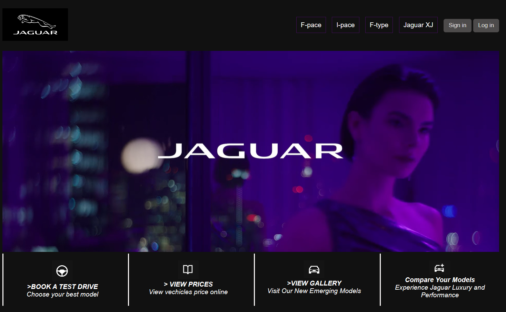
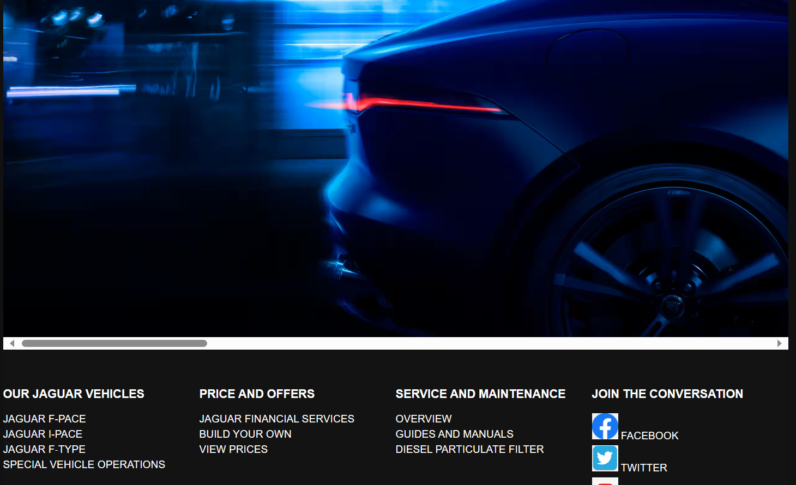

# Jaguar-Motors-Franchise-Website
Welcome to the official GitHub repository for the Jaguar Motors franchise website. Explore our range of luxury vehicles and discover exceptional driving experiences.

## Table of Contents

- [Screenshots](#screenshots)
- [Technologies Used](#technologies-used)
- [Features](#features)
- [Contributing](#contributing)

## Screenshots

## Technologies Used

- HTML5,
- JavaScript
- CSS
- PHP
- MySQL

## Features

- Interactive vehicle catalog with filter options.
- Test drive request and conformation form.
- A to Z car details
- Gallery for interior ,exterior and models.
- singin form
- Database connectivity with zampp.
- php and javascript to handle errors.
- scancitization and filtering to clean the datas.

This project is not published, main focus is to use and test the advanced frontend languages.
